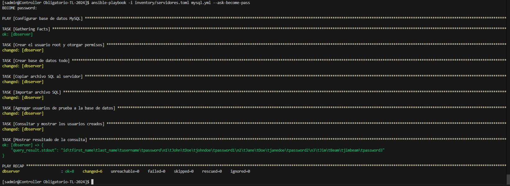

# Taller de Linux

## 🔢 Tabla de contenidos:
- [Taller de Linux](#taller-de-linux)
  - [🔢 Tabla de contenidos:](#-tabla-de-contenidos)
  - [Presentación del problema *`Letra`*](#presentación-del-problema-letra)
    - [PARTE A](#parte-a)
    - [PARTE B](#parte-b)
    - [PARTE C](#parte-c)
    - [PARTE D](#parte-d)
  - [Contenido de este Repositorio](#contenido-de-este-repositorio)
- [Propuesta](#propuesta)
  - [Implementación](#implementación)
    - [Controller](#controller)
      - [Nomenclatura utilizada](#nomenclatura-utilizada)
      - [Usuario Admin](#usuario-admin)
  - [Playbook en el servidor Cent0s9](#playbook-en-el-servidor-cent0s9)
    - [Tareas a realizar](#tareas-a-realizar)
      - [Bloque de configuración (Centos):](#bloque-de-configuración-centos)
  - [Playbook en el servidor Ubuntu 🚀](#playbook-en-el-servidor-ubuntu-)
      - [Bloque de configuración (Ubuntu):](#bloque-de-configuración-ubuntu)
      - [Bloque de configuración todo:](#bloque-de-configuración-base-de-datos-todo)
- [Pruebas de funcionamiento](#pruebas-de-funcionamiento)
  - [Despliegue sin errores ...](#probamos-ingresar-usuario-nuevo-y-loguearnos-a-la-base)
- [Conclusiones](#conclusiones)
- [Anexo](#anexo)
  - [Referencias externas](#referencias-externas)
---


## Presentación del problema *` Letra `*
### PARTE A

- Debe tener listo un servidor controlador para poder utilizar Ansible. Este servidor se preparará
  durante el taller. Debe tener los paquetes y librerías necesarias para utilizar Ansible y Git. El
  usuario que ejecute los automatismos debe contar con sus claves pública/privada SSH. Debe
  contar con un repositorio de código en Github o en Gitlab para trabajar con su equipo.

### PARTE B

- Instalar 2 servidores, ambos con un disco de 13GB el siguiente diseño de particiones:
  
       ● Partición de 1GB para /boot
       ● LVM de 7GB para /
       ● LVM de 3GB para /var
       ● LVM de 2GB para SWAP

- Cada servidor tendrá 1CPU y 2 GB RAM.
- Un servidor debe ser instalado con una distribución de la familia Red Hat (se sugiere CentOS Stream 8 o 9) y el otro debe tener Ubuntu 24.04
- Cada servidor debe tener 2 interfaces de red, 1 conectada a NAT y la otra a una red Interna o Host-Only que le permita conectarse al servidor controlador con Ansible.
- Cada equipo debe contar con un usuario NO root, con permisos para ejecutar comandos como administrador (ansible o sysadmin) y debe copiarse la clave pública del Servidor Controlador, para poder ejecutar los automatismos.

### PARTE C

Tareas a realizar mediante Ansible:

1) En el servidor Red Hat debe instalar la aplicación ToDo usada para el obligatorio del curso
Administración de Servidores Linux
Instalar el JDK de Java, Tomcat y la aplicación con su configuración a la Base de Datos
Tomcat debe iniciarse como servicio mediante SystemD. Los puertos usados por Tomcat deben estar
habilitados en el Firewall

2) En el servidor Ubuntu debe instalar la Base de Datos, y configurarla para la aplicación.
Instalar el servidor MariaDB y asegurarlo con los procedimientos de mysql-secure-installation. Crear
el usuario para la aplicación, y asegurar que el servidor esté levantado. En el Firewall debe estar
permitido el acceso a la Base de Datos.

### PARTE D

Todo el contenido del obligatorio debe estar un un repositorio Git. El repositorio debe tener un
README que describa cómo se usan los playbooks desarrollados.
Debe incluir un directorio Documentación que contenga un documento con toda la descripción de las
tareas realizadas y prueba de ejecución de los playbook y funcionamiento de las aplicaciones.
El repositorio se puede descargar como Zip, y usarse como entrega.

---
## Contenido de este Repositorio
  - ```Docs/```
    - Letra el obligatorio y documentos extras
  - ```imagenes/```
    - Diagramas de arquitectura, screenshots de pruebas y logo del README.md.
  - ```./```
    - Archivos .gitignore y README.md.


---
# Propuesta

  - Configuramos el servidor Controller en clase para ejecutar Ansible, en el README.md esta parte de lo instalado en el mismo para poder desplegar los playbooks.
  - Montamos 2 servidores (centos y Ubuntu) de acuerdo a los requerimientos para ejecutar los servicios.
  - Para el despliegue de la aplicación se cren 3 playbook de Ansible, uno para el webserver y 2 para el dbserver.

  
## Implementación
  La arquitectura diseñada para la ejecución de Ansible en los servidores.

### Controller

- **Descripción**: El controller despliega ansible en los servidores.

#### Nomenclatura utilizada

| Servidor                  | Linux              | Descripción                                    | Subred          |                   |
|--------------------------------|-------------------|------------------------------------------------|-----------------|--------------------|
| Controller                     | Centos 9 Stream          | Despliega Ansible                              | 192.168.56.101       | -                  |
| webserver01           | Centos 9 Stream              |  Aplicación ToDo                           | 192.168.56.103        | -                  |
| dbserver                | Ubuntu      | Base de datos                              | 192.168.56.104        | -                  |

### 

#### Usuario Admin

- Generamos el usuario **sysadmin** para gestionar todos los servidores con permiso de administrador y contraseña **tLxadmin**
- Generamos la clave publica y privada en nuestro controller
- Copio la clave publica a los servidores Web y DB

 ```markdown
ssh-copy-id -f sysadmin@192.168.56.103
ssh-copy-id -f sysadmin@192.168.56.104
 ```

## Verificamos con ansible la estructura solicitada de nuestros  servidores:

```
ansible all -i inventory/servidores.toml -u sysadmin -m shell -a "lsblk -o NAME,SIZE,FSTYPE,TYPE,MOUNTPOINT" --become --ask-become-pass
```


## Playbook en el servidor Cent0s.9


### Tareas a realizar

En este playbook se realizan las siguientes tareas:

1. - name: Instalo el JAVA SDK
2. - name: Bajo e inicio Tomcat
3. - name: abrir los puertos 8080 y 8443 en el firewall.
4. - name: Despliegue de la aplicación ToDo.war en Tomcat.
5. - name: Se configura la aplicación ToDo.war mediante un archivo de configuración Files/app.properties para que apunte a la base de datos:

```
tipoDB=mysql
jdbcURL=jdbc:mysql://192.168.56.104:3306/todo
jdbcUsername=sysadmin
jdbcPassword=tlxadmin
```

#### Bloque de configuración (webserver):

**Comando utilizado para ejecutar**
```
ansible-playbook -i inventory/servidores.toml instalar.todo.yml --ask-become-pass
```

```
---
- name: Instalar todo en el webserver
  hosts: webserver01
  become: true
  user: sysadmin
  vars:
    db_user: "sysadmin"
    db_password: "tlxadmin"
    db_host: "192.168.56.104"
    db_name: "todo"
  tasks:
    - name: Instalar Java JDK
      yum:
        name: java-1.8.0-openjdk
        state: present

    - name: Instalar Tomcat
      yum:
        name: tomcat
        state: present

    - name: Iniciar y habilitar Tomcat service
      systemd:
        name: tomcat
        state: started
        enabled: yes

    - name: Habilitar puerto 8080 en el firewall para Tomcat
      ansible.posix.firewalld:
        port: 8080/tcp
        state: enabled
        immediate: yes
        permanent: yes

    - name: Copiar la aplicación ToDo a directorio de Tomcat
      ansible.builtin.copy: 
        src: ./Files/todo.war
        dest: /var/lib/tomcat/webapps/todo.war
 
    - name: Verifico que exista un directorio donde cargar la configuracion d>
      ansible.builtin.file:
        path: /opt/config
        state: directory
        owner: tomcat
        group: tomcat
        mode: '0755'

    - name: Copiar app.properties
      ansible.builtin.copy:
        src: ./Files/app.properties
        dest: /opt/config/app.properties

    - name: Reiniciar Tomcat para desplegar todo
      ansible.builtin.systemd_service:
        name: tomcat
        state: restarted

```

## Playbook en el servidor Ubuntu 🚀


### Tareas a realizar en el dbserver

En este playbook se realizan las siguientes tareas:

1. - name: Instalamos PYMYSQL
2. - name: Instalamos MariaDB
3. - name: Cambiar la configuracion para escuchar en todas las interfaces
4. - name: Crear archivo de configuración temporal para MySQL
5. - name: Configurar contraseña de root y asegurar MariaDB
6. - name: Crear base de datos
7. - name: Crear usuario de base de datos
8. - name: Configurar el firewall para permitir acceso a MariaDB
9. - name: Eliminar archivo de configuración temporal para MySQL
10. - name: Restart mariadb


#### Bloque de configuración (Ubuntu):

  - **Importante**: Verificar IP del servidor en nuestros archivos de referencia.

- **Comando utilizado para ejecutar**
```
ansible-playbook -i inventory/servidores.toml install.mariadb.yml --ask-become-pass
```

```
---
- name: Instalar MariaDB en server02
  hosts: dbserver
  become: true
  user: sysadmin
  vars:
    db_root_password: "tlxadmin"
    db_user: "sysadmin"
    db_user_password: "tlxadmin"
    db_name: "todo"
  tasks:
    - name: Instalar PyMySQL
      ansible.builtin.apt:
        name: python3-pymysql
        state: present
        update_cache: true

    - name: Instalar MariaDB
      ansible.builtin.apt:
        name: mariadb-server
        state: present
        update_cache: true

    - name: Cambiar la configuracion para escuchar en todas las interfaces
      ansible.builtin.lineinfile:
        path: /etc/mysql/mariadb.conf.d/50-server.cnf
        regexp: '^bind-address'
        line: 'bind-address         = 0.0.0.0'
      notify: Restart mariadb

    - name: Iniciar y habilitar el servicio de MariaDB
      ansible.builtin.systemd:
        name: mariadb
        state: started
        enabled: true

    - name: Crear archivo de configuración temporal para MySQL
      ansible.builtin.copy:
        dest: /root/.my.cnf
        content: |
          [client]
          user=root
          password={{ db_root_password }}
      no_log: true

    - name: Configurar contraseña de root y asegurar MariaDB
      ansible.builtin.shell: |
        mysql -e "SET PASSWORD FOR 'root'@'localhost' = PASSWORD('{{ db_root_password }}');"
        mysql -e "DELETE FROM mysql.user WHERE User='';"
        mysql -e "DROP DATABASE IF EXISTS test;"
        mysql -e "DELETE FROM mysql.db WHERE Db='test' OR Db='test\\_%';"
        mysql -e "FLUSH PRIVILEGES;"
      args:
        executable: /bin/bash

    - name: Crear base de datos
      community.mysql.mysql_db:
        name: "{{ db_name }}"
        state: present

    - name: Crear usuario de base de datos
      community.mysql.mysql_user:
        name: "{{ db_user }}"
        password: "{{ db_user_password }}"
        priv: "{{ db_name }}.*:ALL"
        host: "%"
        state: present

    - name: Configurar el firewall para permitir acceso a MariaDB
      community.general.ufw:
        rule: allow
        port: '3306'
        proto: tcp

    - name: Eliminar archivo de configuración temporal para MySQL
      ansible.builtin.file:
        path: /root/.my.cnf
        state: absent

  handlers:

    - name: Restart mariadb
      ansible.builtin.systemd_service: 
        name: mariadb
        state: restarted

```
---

## Bloque de configuración Base de datos (todo):  

### Tareas a realizar en el dbserver

En este playbook se realizan las siguientes tareas:

1. - name: Crear el usuario root y otorgar permisos
2. - name: Crear base de datos todo
3. - name: Copiar archivo SQL al servidor
4. - name: Importar archivo SQL
5. - name: Agregar usuarios de prueba a la base de datos
6. - name: Consultar y mostrar los usuarios creados
7. - name: Mostrar resultado de la consulta

Aqui configuramos la base de datos y hacemos pruebas para verificar que la misma funcione.

**Comando utilizado para ejecutar**
```
ansible-playbook -i inventory/servidores.toml mysql.yml --ask-become-pass
```

```
---
- name: Configurar base de datos MySQL
  hosts: database
  become: true
  user: sysadmin
  tasks:
    - name: Crear el usuario root y otorgar permisos
      ansible.builtin.shell: |
        mysql -u root -p'{{ db_root_password }}' -e "CREATE USER 'root'@'%' IDENTIFIED BY '{{ db_root_password }}';"
        mysql -u root -p'{{ db_root_password }}' -e "GRANT ALL PRIVILEGES ON *.* TO 'root'@'%' WITH GRANT OPTION;"
        mysql -u root -p'{{ db_root_password }}' -e "FLUSH PRIVILEGES;"
      args:
        executable: /bin/bash
      environment:
        MYSQL_PWD: "{{ db_root_password }}"
      vars:
        db_root_password: "tlxadmin"

    - name: Crear base de datos todo
      ansible.builtin.shell: |
        mysql -u root -p'{{ db_root_password }}' -e "CREATE DATABASE IF NOT EXISTS todo;"
      args:
        executable: /bin/bash
      environment:
        MYSQL_PWD: "{{ db_root_password }}"
      vars:
        db_root_password: "tlxadmin"

    - name: Copiar archivo SQL al servidor
      ansible.builtin.copy:
        src: ./Files/todo.sql
        dest: /tmp/todo.sql

    - name: Importar archivo SQL
      ansible.builtin.shell: |
        mysql -u root -p'{{ db_root_password }}' todo < /tmp/todo.sql
      args:
        executable: /bin/bash
      environment:
        MYSQL_PWD: "{{ db_root_password }}"
      vars:
        db_root_password: "tlxadmin"

## Creo usuarios y los muestro al final para verificar:

    - name: Agregar usuarios de prueba a la base de datos
      ansible.builtin.shell: |
        mysql -u root -p'{{ db_root_password }}' -e "
        USE todo;
        INSERT INTO users (first_name, last_name, username, password) VALUES ('Pepe', 'Momo', 'pmomo', 'password1');
        INSERT INTO users (first_name, last_name, username, password) VALUES ('Tita', 'Merelo', 'tmerelo', 'password2');
        INSERT INTO users (first_name, last_name, username, password) VALUES ('Tito', 'Perez', 'tperez', 'password3');
        "
      args:
        executable: /bin/bash
      environment:
        MYSQL_PWD: "{{ db_root_password }}"
      vars:
        db_root_password: "tlxadmin"

    - name: Consultar y mostrar los usuarios creados
      ansible.builtin.shell: |
        mysql -u root -p'{{ db_root_password }}' -e "
        USE todo;
        SELECT * FROM users;
        "
      args:
        executable: /bin/bash
      environment:
        MYSQL_PWD: "{{ db_root_password }}"
      register: query_result
      vars:
        db_root_password: "tlxadmin"

    - name: Mostrar resultado de la consulta
      ansible.builtin.debug:
        var: query_result.stdout
```

Agregamos la configuración de la base de datos e¿a Files/todo.sql, en la priera línea agregamos lo siguiente `DROP DATABASE IF EXIST todo`, para sobrescribir la base si ya existe. Perdemos todo lo creado...

Podriamos utilizar en su lugar CREATE DATABASE IF NOT EXIST todo; y agregar lo mismo en cada tabla.

```
DROP DATABASE IF EXISTS todo;
CREATE DATABASE todo;
USE todo;
CREATE TABLE `users` (
    `id` int(3) NOT NULL AUTO_INCREMENT,
    `first_name` varchar(20) DEFAULT NULL,
    `last_name` varchar(20) DEFAULT NULL,
    `username` varchar(250) DEFAULT NULL,
    `password` varchar(20) DEFAULT NULL,
    PRIMARY KEY (`id`)
) ENGINE=InnoDB DEFAULT CHARSET=utf8mb4 COLLATE=utf8mb4_general_ci;
CREATE TABLE `todos` (
    `id` bigint(20) NOT NULL AUTO_INCREMENT,
    `description` varchar(255) DEFAULT NULL,
    `is_done` bit(1) NOT NULL,
    `target_date` datetime(6) DEFAULT NULL,
    `username` varchar(255) DEFAULT NULL,
    `title` varchar(255) DEFAULT NULL,
    PRIMARY KEY (`id`)
) ENGINE=InnoDB AUTO_INCREMENT=8 DEFAULT CHARSET=utf8mb4 COLLATE=utf8mb4_general_ci;
CREATE USER IF NOT EXISTS 'todo'@'%' IDENTIFIED BY 'prueba2024';
GRANT ALL PRIVILEGES ON todo.* TO 'todo'@'%';
FLUSH PRIVILEGES;
```

# Pruebas de funcionamiento

## Hardening de servidores

  

## Playbbok para el webserver

  

## Playbook para el dbserver

  

## Playbook para crear base de datos

  

## PROBAMOS INGRESAR USUARIO NUEVO y LOGUEARNOS A LA BASE

   

  

  

  


# Conclusiones

 - Como posibilidad de mejora, podriamos utilizar variables para no tener que modificar en todos lados las direcciones de los servidores al desplegar.

---
# Anexo

[DOCUMENTO_OBLI](ObligatorioTL2024.docx)

## Referencias externas

- Consulta en ChatGPT: "Como puedo hacer para consultar con ansible el tamaño y las particiones de los discos de otro equipo, enviando el el usuario sysadmin para que ejecute con el mismo"
- [Repo en GIT](<https://github.com/orlandiego/Obligatorio-TL-2024>)
- [Git emverdes](https://github.com/emverdes/docker-tomcat-tutorial)
- [Ansible Docs](https://docs.ansible.com/ansible/latest/collections/ansible/builtin/lineinfile_module.html)
- [Hacer Readme](https://www.makeareadme.com)

### Para acceder por SSH

[Modulo para enviar clae publica SSH](https://docs.ansible.com/ansible/latest/collections/ansible/posix/authorized_key_module.html)

---
### Referencias utilizadas para el despliegue del webserver
---

- [INSTALO-JAVA](https://www.geeksforgeeks.org/how-to-install-java-using-ansible-playbook/)

- [INSTALO-TOMCAT](https://github.com/jmutai/tomcat-ansible/blob/master/tomcat-setup.yml)   

- [ABRO PUERTOS](https://docs.ansible.com/ansible/latest/collections/ansible/posix/firewalld_module.html)

- [COPIO APP](https://docs.ansible.com/ansible/latest/collections/ansible/builtin/copy_module.html#ansible-collections-ansible-builtin-copy-module)

- [COPIO CONFIG](https://docs.ansible.com/ansible/latest/collections/ansible/builtin/template_module.html#ansible-collections-ansible-builtin-template-module)


- ***Material de clase y ejercicios realizados**: Material del curso, reutilización de codigo de los trabajos realizados*

---
