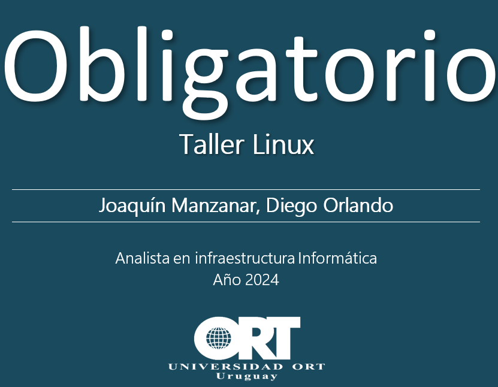
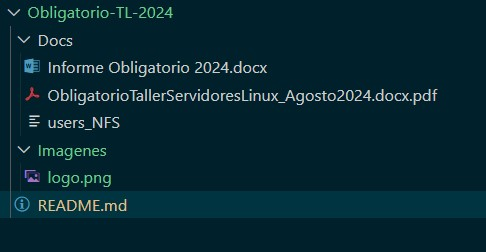

# Taller de Linux

## 🔢 Tabla de contenidos:
- [Taller de Linux](#taller-de-linux)
  - [Presentación del problema *`Letra`*](#presentación-del-problema-letra)
    - [PARTE A](#parte-a)
    - [PARTE B](#parte-b)
    - [PARTE C](#parte-c)
    - [PARTE D](#parte-d)
  - [Contenido de este Repositorio](#contenido-de-este-repositorio)
- [Propuesta](#propuesta)
- [Implementación](#implementación)
  - [Controller](#controller)
    - [Usuario Admin](#usuario_Admin)
- [Playbook Centos](#playbook-en-el-servidor-cent0s9)
  - [Configuración](#bloque-de-configuración-centos)
- [Platbook Ubuntu](#playbook-en-el-servidor-ubuntu-)
  - [Configuración](#bloque-de-configuración-ubuntu)
 - [Pruebas de funcionamiento](#pruebas-de-funcionamiento)
- [Conclusiones](#conclusiones)
- [Anexo](#anexo)
  - [Referencias externas](#referencias-externas)
---


## Presentación del problema *` Letra `*
### PARTE A

- Debe tener listo un servidor controlador para poder utilizar Ansible. Este servidor se preparará
  durante el taller. Debe tener los paquetes y librerías necesarias para utilizar Ansible y Git. El
  usuario que ejecute los automatismos debe contar con sus claves pública/privada SSH. Debe
  contar con un repositorio de código en Github o en Gitlab para trabajar con su equipo.

### PARTE B

- Instalar 2 servidores, ambos con un disco de 13GB el siguiente diseño de particiones:
  
       ● Partición de 1GB para /boot
       ● LVM de 7GB para /
       ● LVM de 3GB para /var
       ● LVM de 2GB para SWAP

- Cada servidor tendrá 1CPU y 2 GB RAM.
- Un servidor debe ser instalado con una distribución de la familia Red Hat (se sugiere CentOS Stream 8 o 9) y el otro debe tener Ubuntu 24.04
- Cada servidor debe tener 2 interfaces de red, 1 conectada a NAT y la otra a una red Interna o Host-Only que le permita conectarse al servidor controlador con Ansible.
- Cada equipo debe contar con un usuario NO root, con permisos para ejecutar comandos como administrador (ansible o sysadmin) y debe copiarse la clave pública del Servidor Controlador, para poder ejecutar los automatismos.

### PARTE C

Tareas a realizar mediante Ansible:

1) En el servidor Red Hat debe instalar la aplicación ToDo usada para el obligatorio del curso
Administración de Servidores Linux
Instalar el JDK de Java, Tomcat y la aplicación con su configuración a la Base de Datos
Tomcat debe iniciarse como servicio mediante SystemD. Los puertos usados por Tomcat deben estar
habilitados en el Firewall

2) En el servidor Ubuntu debe instalar la Base de Datos, y configurarla para la aplicación.
Instalar el servidor MariaDB y asegurarlo con los procedimientos de mysql-secure-installation. Crear
el usuario para la aplicación, y asegurar que el servidor esté levantado. En el Firewall debe estar
permitido el acceso a la Base de Datos.

### PARTE D

Todo el contenido del obligatorio debe estar un un repositorio Git. El repositorio debe tener un
README que describa cómo se usan los playbooks desarrollados.
Debe incluir un directorio Documentación que contenga un documento con toda la descripción de las
tareas realizadas y prueba de ejecución de los playbook y funcionamiento de las aplicaciones.
El repositorio se puede descargar como Zip, y usarse como entrega.

---
## Contenido de este Repositorio
  - ```Docs/```
    - Letra el obligatorio y documentos extras
  - ```imagenes/```
    - Diagramas de arquitectura, screenshots de pruebas y logo del README.md.
  - ```./```
    - Archivos .gitignore y README.md.




---
# Propuesta

  - Configuramos el servidor Controller en clase para ejecutar Ansible
  - Montamos 2 servidores de acuerdo a los requerimientos para ejecutar los servicios
  - Para el despliegue de la aplicación se cren 2 playbook de Ansible apuntando a cada servidor...


## Implementación
  La arquitectura diseñada para la ejecución de Ansible en los servidores:

### Controller

- **Descripción**: El controller despliega ansible en los servidores.

#### Nomenclatura utilizada

| Servidor                  | Linux              | Descripción                                    | Subred          |                   |
|--------------------------------|-------------------|------------------------------------------------|-----------------|--------------------|
| Controller                     | Centos 9 Stream          | Despliega Ansible                              | 192.168.56.10         | -                  |
| WebServer           | Centos 9 Stream              |  Aplicación ToDo                           | 192.168.56.20        | -                  |
| DBServer                | Ubuntu      | Base de datos                              | 192.168.56.30        | -                  |


#### Usuario Admin

- Generamos el usuario **app-admin** para gestionar todos los servidores con permiso de administrador.

 ```markdown
sudo adduser
 ```

## Playbook en el servidor Cent0s9
Al ....

### Tareas a realizar

En este playbook se realizan las siguientes tareas:

1. - Se actualizan todos los paquetes e instalan las dependencias necesarias.
2. - Se instala el JDK de Java.
3. - Se crea un usuario para Tomcat.
4. - Se descarga y extrae Tomcat en el directorio /opt/.

#### Bloque de configuración (Centos):

```
---
- name: Playbook para instalar ToDo en CentOS 9
  hosts: WebServer
  tasks:

```

## Playbook en el servidor Ubuntu 🚀

Para el lanzamiento de
**ansible** 

#### Bloque de configuración (Ubuntu):

  - **Launch Configuration**: Define las especificaciones de cada instancia EC2, como la imagen AMI, tipo de instancia, y configuración inicial.

```
---
- name: Playbook para instalar MariaDB en Ubuntu
  hosts: DBServer
  become: yes

  tasks:

```
  
# Pruebas de funcionamiento

 -  **VIDEO DE LA DEMO CON EL DESPLIEGUE DE LA SOLUCIÓN**:

https://youtu.be/

## Despliegue sin errores ...

  


# Conclusiones

hiiugiuh


---
---
# Anexo

## Referencias externas

- [Repo en GIT](<https://github.com/orlandiego/Obligatorio-TL-2024>)

- ***Material de clase y ejercicios realizados**: Material del curso, reutilización de codigo de los trabajos realizados*

---
